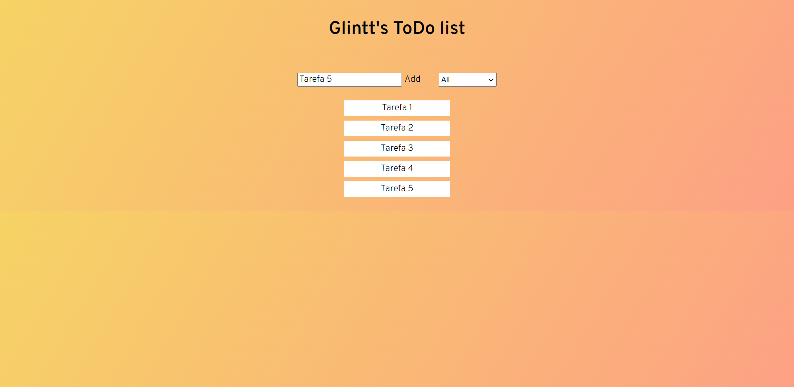
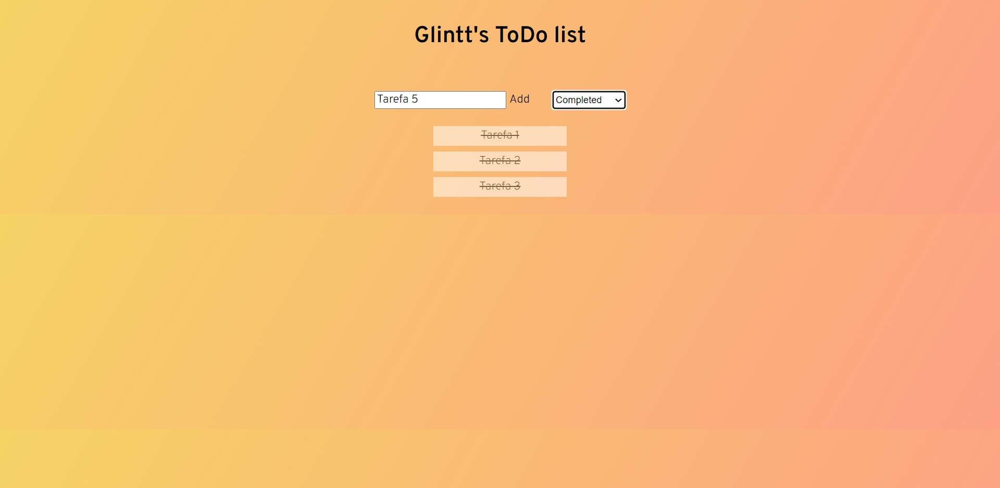
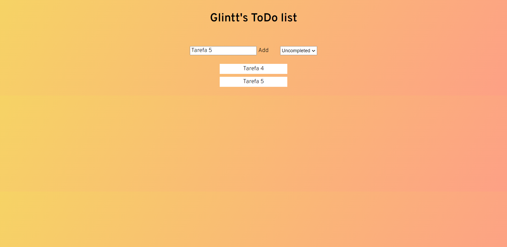

# Glintt's ToDo List

This is a solution to Glintt's ToDo List.

## Table of contents

- [Overview](#overview)
  - [Screenshots](#screenshot)
  - [Links](#links)
- [My process](#my-process)
  - [Built with](#built-with)

## Overview

Users should be able to:

- Fill in the input field and see tasks appear below.
- See hover, active, and focus states for interactive elements on the page.
- Click on a task to mark it as completed.
- Filter tasks by "Completed", "Uncompleted" or "All".

### Screenshots

### Links

- Solution URL: [https://github.com/pedrommb7/glintt-todo-app](https://github.com/pedrommb7/glintt-todo-app)

## My process

### Built with

- HTML5
- SCSS
- Flexbox
- Atomic design
- [React-TypeScript](https://create-react-app.dev/docs/adding-typescript/)
